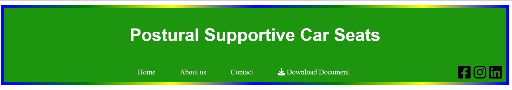
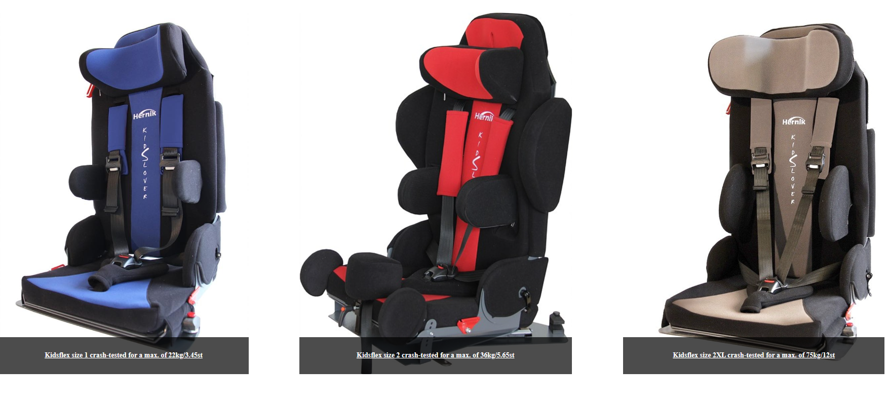
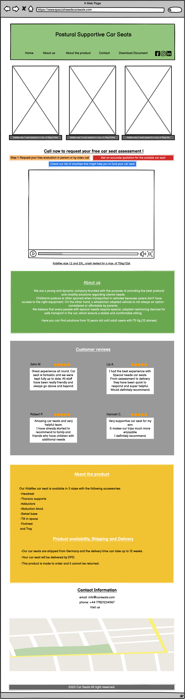
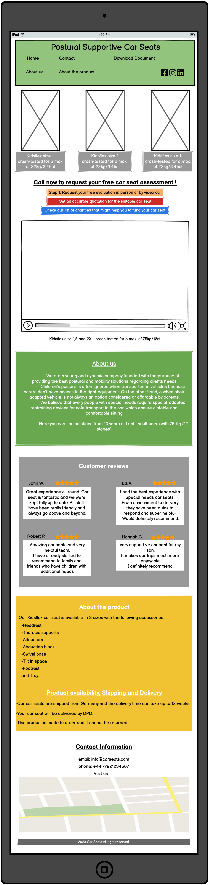
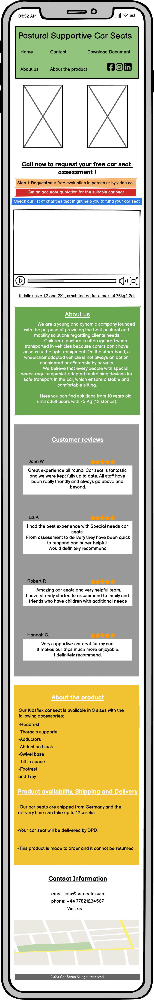

# Special needs Car Seats
## <u>About</u>
**The Special Car Seats** website aims to provide parents and caregivers of children with special needs a convenient platform to browse and enquiry car seats that prioritize postural support, safety, comfort, and functionality.

 We understand the unique requirements of these children and have curated a collection of car seats designed to meet their specific needs.

 Our car seats have a wide variety of accessories to give the best possible support such as:

 * aluminium backrest
 * thoracic supports
 * 5-point harness
 * adductors
 * abduction block
 * swivel base
 * isofix
 * footplate
 * tray

## Project goals

The primary goal of Special needs car seats is to provide a clean, intuitive, and accessible website to provide information for the users/clients about supportive car seats for children with special needs.
This website has two target audiences, the first one are the parents/relatives of children with special needs and the second one are the Healthcare professionals that might prescribe this kind of equipment.

## User needs

* Find information about the product.
* Findcontacts to get in touch with the seller.
* Watch pictures of the product.
* Be aware of all the features and accessories available for each car seat.
* Get access the prescription form.
* Find information about shipping and delivery.
* Know more about the company.
* Understand how to buy the product.

## Developer goals
* Build a user-friendly and intuitive website interface for easy navigation and browsing of car seat products.
* Develop a responsive design that adapts seamlessly to different devices and screen sizes, ensuring a consistent experience for users.
* Integrate effective search functionality to enable users to find specific car seat models based on various criteria such model, size, safety features, etc.
* Incorporate a customer review and rating system to provide social proof and assist customers in making informed purchasing decisions.
* Integrate social media sharing features to allow users to share product details and reviews with their networks.

## Business goals
* Increase online sales of car seats by providing a convenient and accessible platform for customers to browse and purchase products.
* Build a strong brand reputation and establish credibility in the car seat market.
* Expand the customer base by targeting a wide range of consumers, including parents, caregivers, and businesses in need of car seats.
* Offer a diverse range of car seat options to cater to different budgets, preferences, and safety requirements.
* Provide detailed product information, including safety features, specifications, and installation guidelines, to educate customers and build trust.

 ## Existing Features
### <u>Navigation Bar</u>

The full responsive navigation header includes links to the Home page, About us, Contact and a link to download a prescription form.
This section will allow the user to easily navigate and find the required information.

### <u>The landing page image</u>
The landing includes the pictures of the three models/sizes Kidsflex car seats with caption explaning the crash-test weight capacities.

### <u>Video section</u>
Scrolling down the user will find a short explanation about the process of purchasing their own car seat and a video showing all the features/adjustments possible on equipment.

### <u>About us</u>
This section explins who is the company and the purpose of the product.

### <u>Contact Information</u>
In contact information you can find the email address, phone number and location map (embed Google Maps) of the company.

## Validator Testing

<u>HTML</u>
* Three errors were returned when passing through the [W3C CSS Validaton Service](https://jigsaw.w3.org/css-validator/) but have no impact on the usage or website view.

<u>CSS</u>
* No errors were found when passing through the [W3C CSS Validaton Service](https://jigsaw.w3.org/css-validator/)

## Unfixed Bugs
No bugs found

## Deployment 
* The site was deployed to GitHub pages. 
* The steps to deploy are as follows:
In the GitHub repository, navigate to the Settings tab
From the source section drop-down menu, select the Master Branch.
* Once the master branch has been selected, the page will be automatically refreshed with a detailed ribbon display to indicate the successful deployment.

## Installation
Special needs car seats is a website that can be accessed directly through any modern web browser. No installation is required.

## Credits

### <u>Media</u>
* All images have been taken from [Lazarehab](https://www.lazarehab.com).

* The video has been taken from  [Lazarehab](https://www.lazarehab.com).

* The prescrition form has been taken from  [Lazarehab](https://www.lazarehab.com).

### <u>Content</u>
* All logos have been downloaded from [Font Awesome](www.fontawesome.com).

* Information how to setup readme file taken from [Youtube](www.youtube.com/shorts/4z0l5Kl2Q6E).

* Information how to code emebd Google Maps locations from [Youtube](www.youtube.com/watch?v=4U_AAGHzTok)

* Codes and ideas from my previous project.

* readme template from Github.

## Contributing
We welcome contributions from the community to help improve _Special needs car seats_ and make it even more valuable for individuals seeking addiction recovery resources. 

If you would like to contribute, please follow these guidelines:

1. Fork the repository. 

2. Make your changes or additions. 

3. Test thoroughly to ensure everything is functioning as expected. 
4. Submit a pull request, clearly describing the changes you have made and why they are beneficial.

5. Please note that all contributions will be subject to review and approval by the _Special needs Car Seats_ team.

